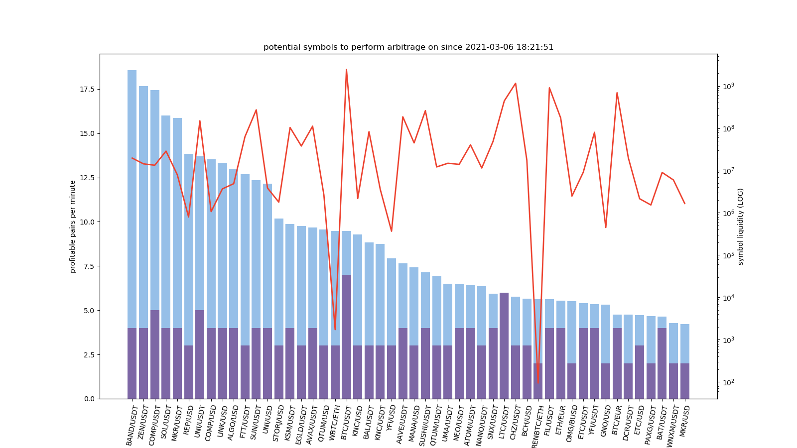

# SAMWise

## Spatial Arbitrage Method Wizard

Arbitrage is a way to generate passive income off of the price differences of a currency on multiple exchanges. The idea is that you buy on the lowest exchange, and simultaneously sell on the highest exchange. Since the prices move around and the high and low exchanges tend to flip-flop, there isn't a need to move assets between exchanges after each transaction. SAMWise takes advantage of these price discrepancies and automatically executes the profitable trades to make a profit off the differences.

## Findings

Currently, this is still a work in progress, but it looks incredibly promising. Because the high and low exchanges flip-flop and generally are in no way static, there seems to be potentional for passive income generation here. However, choosing which currency to act on will be an interesting challenge. Once I choose one, I will then run tests on the time it takes to execute a trade via a limit order. As long as both the buy and sell orders fill in relatively similar times, the strategy should remain viable.

## Process

The basic design of the program is pretty straightforward. The main class uses the [ccxt](https://github.com/ccxt/ccxt) library to connect to the API for each individual exchange. It polls the price for the given cryptocurrency pair on each connected exchange, finds the lowest and highest pair, and then runs a calculation to determine if selling on one and buying on the other will produce a profit after fees. If yes, then it checks if each account has the correct balances, and then submits a limit order (one for buy and one for sell) to each respective exchange. However, if the balances are too low, it also checks to see if the next highest and/or next lowest pairs are profitable as well, and so on until it either runs out of profitable pairs, or an action is taken. This way, it may still be able to turn a profit even if the ideal balances aren't in the right places. Additionally, I implemented a feature called speedup. It's a percent that tightens the margin by `speedup` percent, decreasing profit per trade, but increasing trade frequency. This is due to the time it takes to execute limit orders. Lastly, I added a parameter called liquidity. This uses a formula to determine the liquidity of a market, to help find the possible trade execution speed. It runs in a loop so this goes continuously. One important thing to note when looking at the output is the `FF` flag (in green). This flag means that selling at the ask on exhange 1 and buying at the bid on exchange 2 and selling at the ask on exchange 2 and buying at the bid on exchange 1 would both be profitable at the same point in time. This is incredibly important because it basically means that picking one of these `FF` pairs enables your profits to ONLY be limited by trade execution time. You can effectively bounce assets back and forth between the same exchanges.

Currently, speed has been greatly increased. Using a concurrency optimization algorithm I designed, the time it takes to fetch the symbols has been reduced from **10+ minutes** to **less than 1 second.**

The API is in heavy development and is rapidly changing as of now. Due to the size of the database (growing 10M rows a day), even just querying the latest values takes about a minute too long for a standard API call. Most recently, I added an method to store only the latest values within the `DatabaseManager` class. This way, the API can access them, purely through the object itself, instead of waiting on queries from the database.

## Console Output


## Data



## API

The API is now partly functional. It can be accessed through port `5000` on the machine running the server.

### Endpoints

* `/api/v1/status`
* `/api/v1/data`

`/api/v1/status` will return system status and such. Sample response:

```json
{
    "data": {
        "uptime": "00:01:29",
        "lengths": {
            "results": 152842813,
            "spreads": 17712519,
            "summary": 8627197
        },
        "current": "waiting 4s",
        "dbsize": "18.41GB",
        "num_profit": 126,
        "sysInfo": "System Info: Linux - compute - 5.4.0-67-generic - #75-Ubuntu SMP Fri Feb 19 18:03:38 UTC 2021 - x86_64 - x86_64",
        "exchanges": [
            "Binance",
            "Binance US",
            "Bitfinex",
            "Bitstamp",
            "Huobi Pro",
            "Kraken",
            "OKCoin",
            "Phemex"
        ]
    }
}
```

## Database - under construction

The API is run off of a database updated around every 10 seconds. There are three tables, `results`, `spreads`, and `summary`, all related to each other by the `batch` key. The `batch` key is a datetime marking what time the propagation cycle was executed. The timestamps for each symbol received may be slightly different due to the asynchronous design of the `Propagator` class, but the `batch` will be the same for each symbol in that cycle.

### Results Schema


| Field         | Type          | Null | Key | Default | Extra          |
| ------------- | ------------- | ---- | --- | ------- | -------------- |
| id            | int           | NO   | PRI | NULL    | auto_increment |
| symbol        | varchar(20)   | YES  |     | NULL    |                |
| exchange      | varchar(40)   | YES  |     | NULL    |                |
| timestamp     | bigint        | YES  |     | NULL    |                |
| ask           | decimal(20,8) | YES  |     | NULL    |                |
| askVolume     | decimal(20,8) | YES  |     | NULL    |                |
| average       | decimal(20,8) | YES  |     | NULL    |                |
| baseVolume    | decimal(20,8) | YES  |     | NULL    |                |
| bid           | decimal(20,8) | YES  |     | NULL    |                |
| close         | decimal(20,8) | YES  |     | NULL    |                |
| datetime      | datetime      | YES  |     | NULL    |                |
| batch         | datetime      | YES  |     | NULL    |                |
| dx            | decimal(20,8) | YES  |     | NULL    |                |
| high          | decimal(20,8) | YES  |     | NULL    |                |
| last          | decimal(20,8) | YES  |     | NULL    |                |
| low           | decimal(20,8) | YES  |     | NULL    |                |
| open          | decimal(20,8) | YES  |     | NULL    |                |
| percentage    | decimal(20,8) | YES  |     | NULL    |                |
| previousClose | decimal(20,8) | YES  |     | NULL    |                |
| quoteVolume   | decimal(20,8) | YES  |     | NULL    |                |
| vwap          | decimal(20,8) | YES  |     | NULL    |                |


### Spreads Schema


| Field            | Type        | Null | Key | Default | Extra          |
| ---------------- | ----------- | ---- | --- | ------- | -------------- |
| id               | int         | NO   | PRI | NULL    | auto_increment |
| symbol           | varchar(20) | YES  |     | NULL    |                |
| buy              | varchar(40) | YES  |     | NULL    |                |
| sell             | varchar(40) | YES  |     | NULL    |                |
| time             | datetime    | YES  |     | NULL    |                |
| batch            | datetime    | YES  |     | NULL    |                |
| timestamp        | bigint      | YES  |     | NULL    |                |
| buy_ask          | float       | YES  |     | NULL    |                |
| buy_bid          | float       | YES  |     | NULL    |                |
| buy_price        | float       | YES  |     | NULL    |                |
| sell_ask         | float       | YES  |     | NULL    |                |
| sell_bid         | float       | YES  |     | NULL    |                |
| sell_price       | float       | YES  |     | NULL    |                |
| fees             | float       | YES  |     | NULL    |                |
| no_fees          | float       | YES  |     | NULL    |                |
| spread_w_fees    | float       | YES  |     | NULL    |                |
| liquidity        | float       | YES  |     | NULL    |                |
| quote_order_size | int         | YES  |     | NULL    |                |
| speedup          | float       | YES  |     | NULL    |                |


### Summary Schema


| Field            | Type        | Null | Key | Default | Extra          |
| ---------------- | ----------- | ---- | --- | ------- | -------------- |
| id               | int         | NO   | PRI | NULL    | auto_increment |
| batch            | datetime    | YES  |     | NULL    |                |
| symbol           | varchar(20) | YES  |     | NULL    |                |
| spread_w_fees    | float       | YES  |     | NULL    |                |
| speedup          | float       | YES  |     | NULL    |                |
| profitable_pairs | int         | YES  |     | NULL    |                |
| buy              | varchar(40) | YES  |     | NULL    |                |
| sell             | varchar(40) | YES  |     | NULL    |                |
| liquidity        | float       | YES  |     | NULL    |                |


## Class Overview

### Active

* propagator.py
  * handles polling all APIs and creates a dictionary of prices for each exchange for each symbol
* scanner.py
  * calulates the spread for a single symbol
* bouncer.py
  * extends class of scanner.py to enable trading on a single symbol
* hive.py
  * manages multiple scanner and bouncer objects
* tables.py
  * holds the schema classes for the database
* manager.py
  * manages all database operations
* server.py
  * multitasks to run the API and database methods simultaneously
* helper.py
  * holds all custom functions used by two or more classes

### Deprecated

* main.py

## Exchanges

SAMWise supports all exchanges supported by ccxt.

## Installation

Installation is simple; just install dependencies.

```Bash
$ git clone https://github.com/ckinateder/SAMWise.git
$ cd SAMWise
(SAMWise)$ sudo apt-get install mysql-server libmysqlclient-dev python3-pip screen
(SAMWise)$ pip3 install -r requirements.txt
```

**Unfortunately, due to the highly profitable nature of this application, I cannot release the code, so it's currently not available for public use. It will be in the future.**

## Usage

All you have to do is run the server class and follow the prompts.

```
(SAMWise)$ ./serve -h
usage: server.py [-h] [-u USER] [-p PWD] [-H HOST] [-P PORT] [-d DATABASE] [-t TIMER] [-r]

Handle database connections for SAMWise

optional arguments:
  -h, --help            show this help message and exit
  -u USER, --user USER  username
  -p PWD, --pwd PWD     password
  -H HOST, --host HOST  host
  -P PORT, --port PORT  port
  -d DATABASE, --database DATABASE
                        database
  -t TIMER, --timer TIMER
                        timer
  -r, --reset           reset the database
(SAMWise)$ ./serve -t 5
```

## Running From a Server

If you are running from a remote session, run through a screen to make sure it won't disconnect.

```Bash
(SAMWise)$ screen
(SAMWise)$ ./serve
```

Then, Ctrl + A and then Ctrl + D to detach from the session. You can exit the ssh session and it will continue to run. You can later run `screen -r` to reconnect to the screen.

