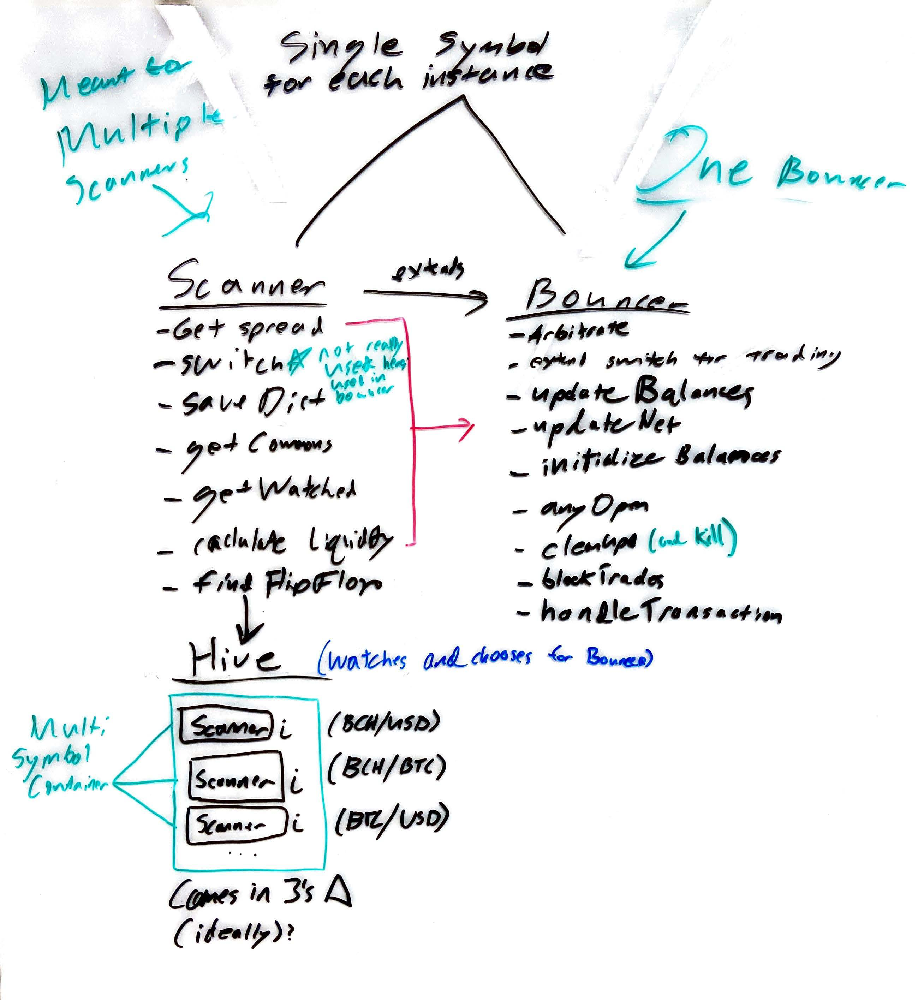
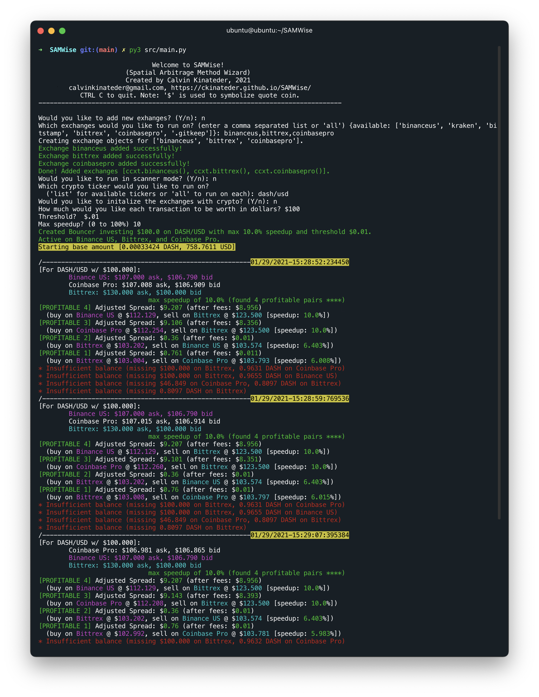
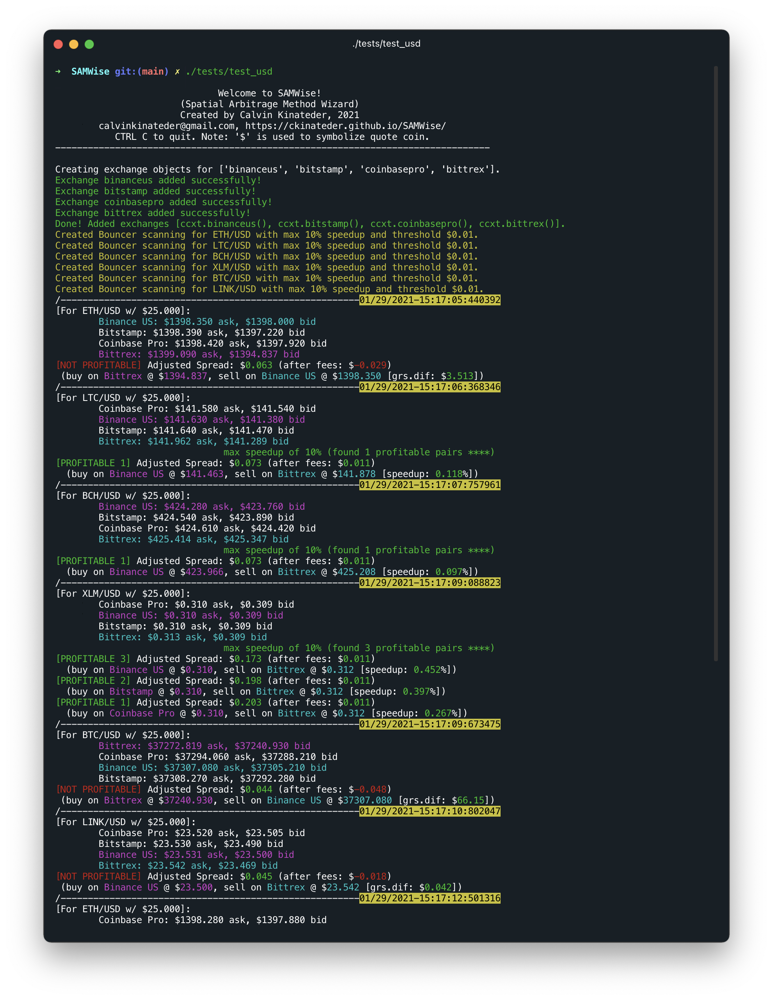

# SAMWise

### Spatial Arbitrage Method Wizard

Arbitrage is a way to generate passive income off of the price differences of a currency on multiple exchanges. The idea is that you buy on the lowest exchange, and simultaneously sell on the highest exchange. Since the prices move around and the high and low exchanges tend to flip-flop, there isn't a need to move assets between exchanges after each transaction.

## Findings

Currently, this is still a work in progress, but it looks incredibly promising. Because the high and low exchanges flip-flop and generally are in no way static, there seems to be potentional for passive income generation here. However, choosing which currency to act on will be an interesting challenge. Once I choose one, I will then run tests on the time it takes to execute a trade via a limit order. As long as both the buy and sell orders fill in relatively similar times, the strategy should remain viable.

## Process


The basic design of the program is pretty straightforward. The main class uses the [ccxt](https://github.com/ccxt/ccxt) library to connect to the API for each individual exchange. It polls the price for the given cryptocurrency pair on each connected exchange, finds the lowest and highest pair, and then runs a calculation to determine if selling on one and buying on the other will produce a profit after fees. If yes, then it checks if each account has the correct balances, and then submits a limit order (one for buy and one for sell) to each respective exchange. However, if the balances are too low, it also checks to see if the next highest and/or next lowest pairs are profitable as well, and so on until it either runs out of profitable pairs, or an action is taken. This way, it may still be able to turn a profit even if the ideal balances aren't in the right places. Additionally, I implemented a feature called speedup. It's a percent that tightens the margin by `speedup` percent, decreasing profit per trade, but increasing trade frequency. This is due to the time it takes to execute limit orders. Lastly, I added a parameter called liquidity. This uses a formula to determine the liquidity of a market, to help find the possible trade execution speed. It runs in a loop so this goes continuously.

## Adding Exchanges

SAMWise supports all exchanges supported by ccxt. To add a new exchange, follow the prompts when running the program.

## Installation

Clone repository and install dependencies by using

```Bash
$ git clone https://github.com/ckinateder/SAMWise.git
$ cd SAMWise
(SAMWise)$ pip3 install -r requirements.txt
```

## Usage

All you have to do is run the main class and follow the prompts.

```Bash
(SAMWise)$ py3 src/main.py
```

## Console Output



