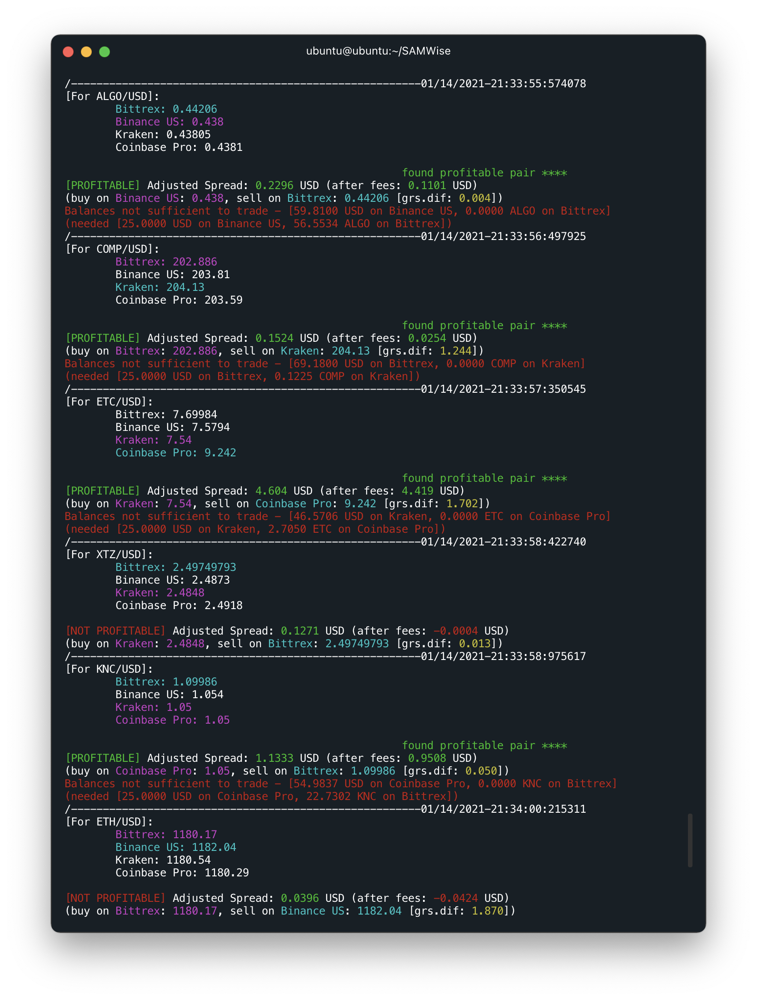

# SAMWise
Spatial Arbitrage Method Wizard

## Findings

Currently, this is still a work in progress, but it looks incredibly promising. Because the high and low exchanges flip flop and generally are in no way static, there seems to be potentional for passive income generation here. However, choosing which currency to act on will be an interesting challenge. Once I choose one, I will then run tests on the time it takes to execute a trade via a limit order. As long as both the buy and sell orders fill in relatively similar times, the strategy should remain viable.

## Installation

Clone repository and install dependencies by using 

```
$ git clone https://github.com/ckinateder/SAMWise.git
$ cd SAMWise
(SAMWise)$ pip3 install -r requirements.txt
```

## Console Output
`(SAMWise)$ python3 src/main.py BCH/USD 30`

